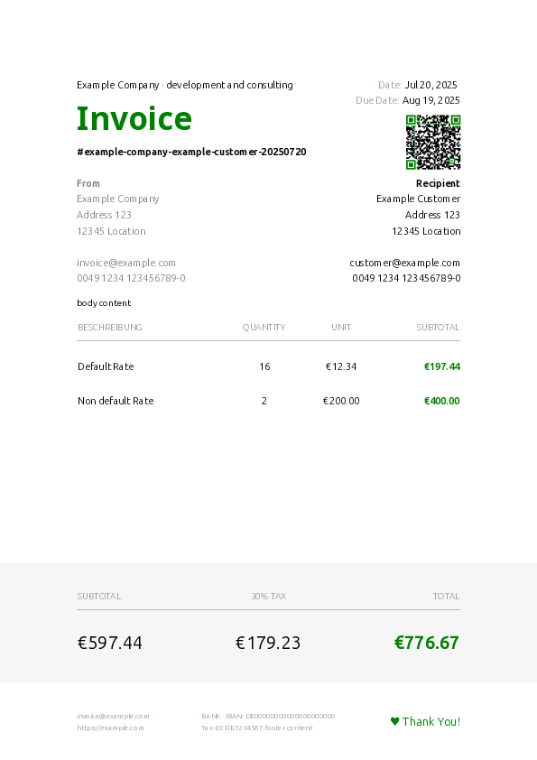
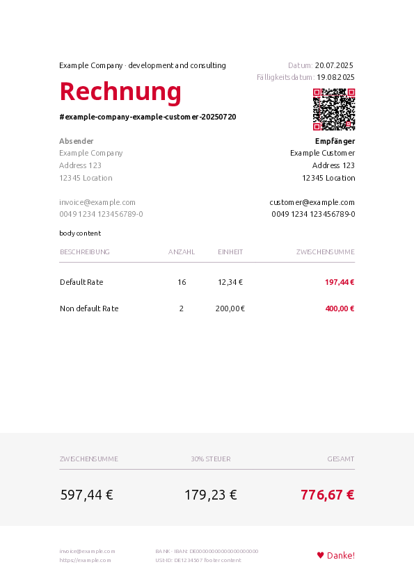

# Invoice-API

Simple API for rendering neat PDF invoices

- small API with a single endpoint (fastAPI)
- customizable PDF templates (jinja2, weasyprint)
- multiple languages (babel) - English (en), German (de)
- includes EPC QR Code/SEPA Payment (segno)





### Quickstart

```shell
docker run -p 8000:80 ghcr.io/rehborn/invoice-api:main
```
```shell
curl http://localhost:8000/ > example-invoice.json
curl -X POST -H "Content-Type: application/json"  -d @example-invoice.json  http://localhost:8000/ > invoice.pdf
```

### Docker compose
```yaml
services:
  invoice-api:
    image: ghcr.io/rehborn/invoice-api:main
    build: .
    ports:
      - "8000:80"
```

### JSON
```json
{
  "draft": true,
  "language": "en",
  "template": "default",
  "color": "d2042d",
  "body": "body content\n",
  "footer": "footer content\n",
  "tax": 30,
  "currency": "EUR",
  "hourly_rate": 12.34,
  "invoice_id": "optional-invoice-id",
  "created_date": "2030-12-01",
  "due_date": "2030-12-31",
  "company": {
    "name": "Example Company",
    "description": "development and consulting",
    "address": "Address 123\n12345 Location\n",
    "tax_id": "DE1234567",
    "email": "invoice@example.com",
    "phone": "0049 1234 123456789-0",
    "web": "https://example.com",
    "bank": "BANK",
    "bic": "BICABCDEFG",
    "iban": "DE00000000000000000000"
  },
  "customer": {
    "name": "Example Customer",
    "address": "Address 123\n12345 Location\n",
    "email": "customer@example.com",
    "phone": "0049 1234 123456789-0"
  },
  "positions": [
    {
      "description": "Default Rate",
      "quantity": 16
    },
    {
      "description": "Non default Rate",
      "quantity": 2,
      "rate": 200.0
    }
  ]
}
```

```shell
curl -X POST -H "Content-Type: application/json"  -d @example-invoice.json  http://localhost:8000/ > invoice.pdf
```

### YAML

```yaml
# draft: true
# language: de
# template: default
color: d2042d

body: |
  body content

footer: | 
  footer content

tax: 30
# currency: EUR
hourly_rate: 12.34

# invoice_id: custom_id_123
# created_date: '2030-12-01'
# due_date: '2030-12-31'

company:
  name: Example Company
  description: development and consulting

  address: |
    Address 123
    12345 Location
  tax_id: DE1234567

  email: invoice@example.com
  phone: 0049 1234 123456789-0
  web: https://example.com

  bank: BANK
  bic: BICABCDEFG
  iban: DE00000000000000000000

customer:
  name: Example Customer
  address: |
    Address 123
    12345 Location

  email: customer@example.com
  phone: 0049 1234 123456789-0

positions:
  - description: Default Rate
    quantity: 16

  - description: Non default Rate
    quantity: 2
    rate: 200.00
```

```shell
INVOICE_API=http://localhost:8000 python yaml2invoice.py example-invoice.yaml
``` 

[schema](src/schema.py)

## Development

setup
```shell
uv sync
```

run fastapi
```shell
uv run python 
```

### PyBabel

extract
```shell
pybabel extract -F babel.cfg -o locale/en/LC_MESSAGES/messages.po .
```

Update
```shell
pybabel update -l de -d locale/ -i locale/en/LC_MESSAGES/messages.po
```

compile 
```shell
pybabel compile -f -d  locale/
```